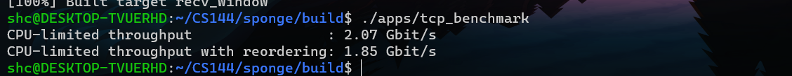

# CS144计网实验

- 官网链接: https://cs144.github.io/
- 基于代码框架，自顶向下实现TCP/IP协议栈(TCP,ARP,NetWorkInterface)，最终通过socketpair和eventloop实现了可靠数据传输的、完全工作在用户态的socket : FullStackSocket。 
- 博客：https://cstardust.github.io/categories/CS144/
- TCP模块压测 
   
